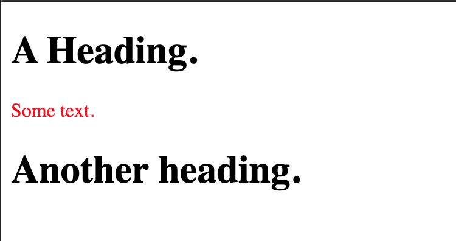
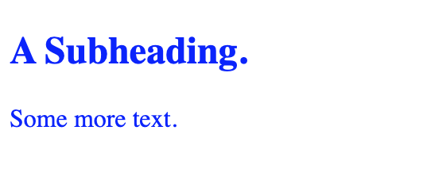
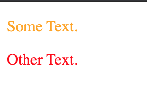

# CSS Zero To Hero Course
[CSS Tutorial](https://www.youtube.com/watch?v=1Rs2ND1ryYc)
___

## Date: 8/29/2021
___

Video Progress: 20.41

- Initial Commit
- Added Directories
  - css
    - style.css
  - html
    - index.html

___

## Date 8/20/2021 - start: 7:12 PM / end: 8:20 PM 

Video Progress: 33:17

Topics:

### Selectors: 22:14

The Element Selector
- You can select entire elements without any special characters
- This applies to all elements with that tag on the page
- It ranks on the bottom of the specificity scale

example
```html
<h1>A Heading.</h1>
<p>Some text.</p>
<h1>Another heading.</h1>
```
```css
p {
  color: red;
}
```
result<br>


The Class Selector
- Used to select elements with a certain class name
- Can be used on any and all elements with that class.
- Can be used multiple times
- Elements selected with the dot (.) symbol.

example
```html
<h2 class="aclass">A Subheading.</h2>
<p class="aclass">Some more text.</p>
```
```css
.aclass {
  color: blue;
}
```
result<br>


The ID Selector
- USed to select elements with a certian ID name
- Can be used on any and all elemnts with that ID
- Unlike classes, it can only be used on one element at a time, and is selected with the hash (#) symbol. Howerver, it's possible to use more than once.

example
```html
<p id="sometext">Some Text.</p>
<p id="othertext">Other Text.</p>
```
```css
#sometext {
  color: orange;
}

#othertext {
  color: red;
}
```
result<br>


### Classes & ID in HTML: 25:56

### Specify & When to use Selectors: 31:55

- [Specificity](https://www.w3schools.com/css/css_specificity.asp)


